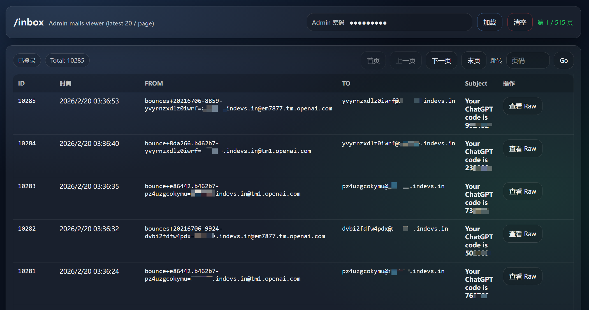

# Cloudflare 收注册验证码的一次性临时邮箱


> 本项目仅供学习和个人用途，请勿将其用于任何违法行为，否则后果自负。

**🎉 一个只是用来收注册验证码的临时邮箱服务！**

- 🆓 **完全免费** - 基于 Cloudflare 免费服务构建，零成本运行
- ⚡ 只收不发，也没有华丽界面，只有简单查询邮件的界面，适用于程序生成邮箱，查询邮件，获得验证码



## 📚 部署文档 - 快速开始

克隆软件 git clone

```bash

git clone https://github.com/zhangrr/cloudflare-temp-email

cd cloudflare-temp-mail/worker

#安装依赖包, node版本v24.13.0
npm install wrangler
npm -i

#生成认证url，调用cf login，ip是wrangler所在服务器地址
npx wrangler login --callback-host 192.168.2.26

#浏览器输入上面的地址，cf登录后会有一个回调url
我们把地址改成192.168.2.26在浏览器打开，就登录成功了

#建立数据库，会得到database_id，记下来
npx wrangler d1 create temp-email-db
npx wrangler d1 execute temp-email-db --file=../db/schema.sql --remote

#建立kv，会得到id，记下来
npx wrangler kv namespace create 

#根据实际情况，编辑wrangler.toml
填入database_id和kv id，修改内容

#部署worker
npx wrangler deploy
```

最后参考：https://linux.do/t/topic/316819

做三件事：

* 把域名托管到CF
* 设置好Email router
* CatchALL 指到咱们新建的Worker，temp-email

然后打开：https://temp-email.user.workers.dev/inbox

输入admin密码，加载就可以查看到注册邮件了

## ✨ 核心功能

<details open>
<summary>✨ 核心功能详情（点击收缩/展开）</summary>

### 📧 邮件处理

- [x] 只能接收邮件

### 🔧 管理功能

- [x] 简洁的 admin 查看邮件界面
- [x] 只能使用`admin`来创建和查看邮件 

## 🏗️ 技术架构

<details>
<summary>🏗️ 技术架构详情（点击收缩/展开）</summary>

### 🏛️ 系统架构

- **数据库**: Cloudflare D1 作为主数据库
- **后端部署**: 使用 Cloudflare Workers 部署后端

### 🛠️ 技术栈

- **数据库**: Cloudflare D1 (SQLite)
- **存储**: Cloudflare KV 

### 📦 主要组件

- **Worker**: 核心后端服务

### 提醒

- 基于 https://github.com/dreamhunter2333/cloudflare_temp_email
- worker 名字中绝不能出现_下划线，否则https证书有问题
- 不要前端，简单搓了一个/inbox来让admin查看邮件
